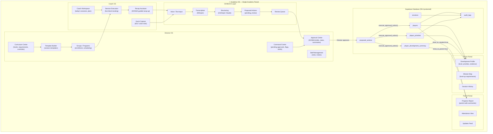
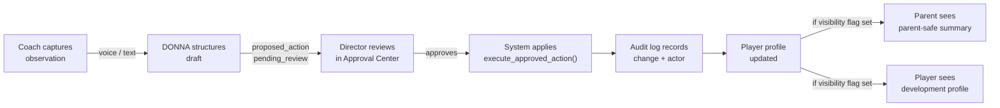

# Executive Product Map

**Last updated:** Sprint 402
**Audience:** Product managers, new engineers, stakeholders
**Purpose:** Shows the full AcademyOS product ecosystem in one view — who uses it, what they do, and how DONNA connects them.
**Related code:** `src/app/director/`, `src/app/coach/`, `src/app/player/`, `src/app/parent/`
**Related docs:** `docs/trust-stack.md`, `docs/permissions-matrix.md`
**When to update:** When a new portal, major feature, or role is added to the product.

---

## Full Product Ecosystem

---

## Operating Model Summary

---

## Key Invariants

- No AI output reaches a core data table without human approval.
- No parent or player sees data without explicit `show_to_parent` / `show_to_student` flags.
- Every mutation is traceable to an actor via `audit_logs`.
- DONNA never approves its own proposals.
- All academies are isolated by `academy_id`; no cross-tenant data leaks.
