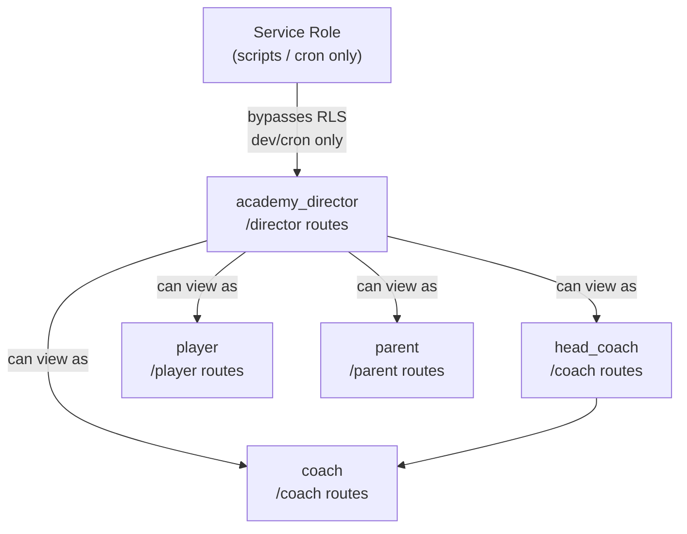
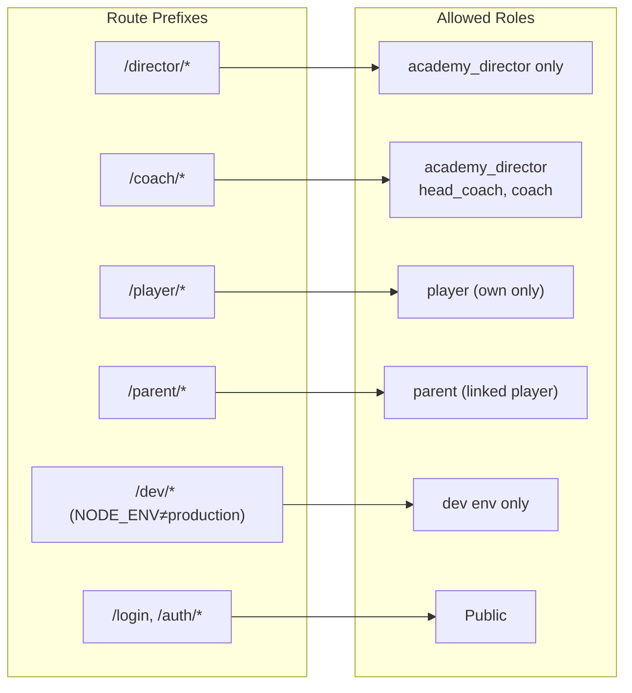
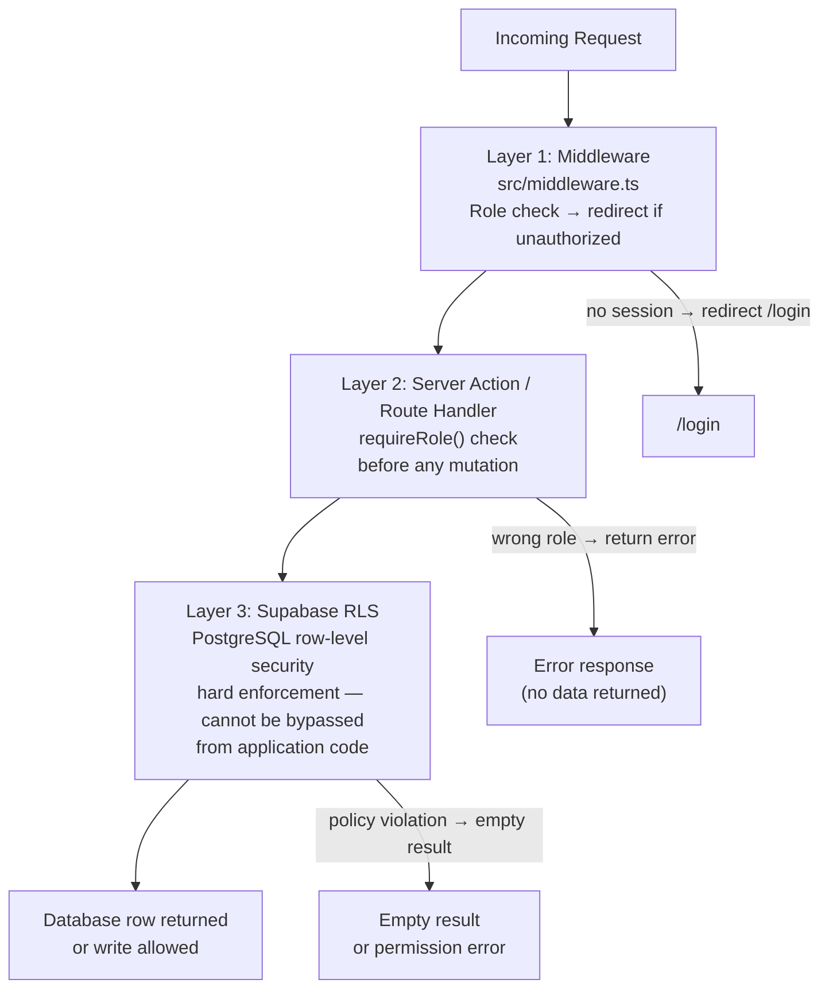
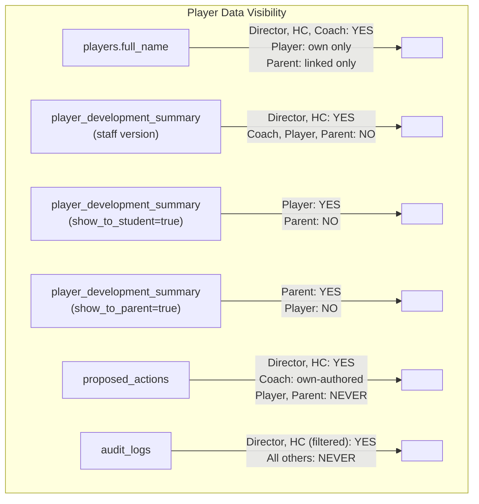

# Role and Permission Map

**Last updated:** Sprint 402
**Audience:** Engineering, security review
**Purpose:** Shows role hierarchy, route access, and where access is enforced.
**Related code:** `src/middleware.ts`, `src/lib/supabase/`, Supabase RLS policies
**Related docs:** `docs/permissions-matrix.md`, `docs/trust-stack.md`
**When to update:** When a new role is added, a new route is created, or RLS policies change.

---

## Role Hierarchy

---

## Route → Role Access

---

## Enforcement Layers (in order)

---

## Data Visibility by Role

---

## Key Access Rules

1. RLS is the hard enforcement layer — application-layer checks are defense-in-depth only.
2. Service role key never appears in Next.js route handlers or server actions.
3. All multi-tenant queries must include `.eq('academy_id', academyId)`.
4. Approval actions (`proposed_actions.status → approved`) require Director or Head Coach role, verified server-side.
5. `execute_approved_action()` validates actor role before executing — the function itself is the final gate.
