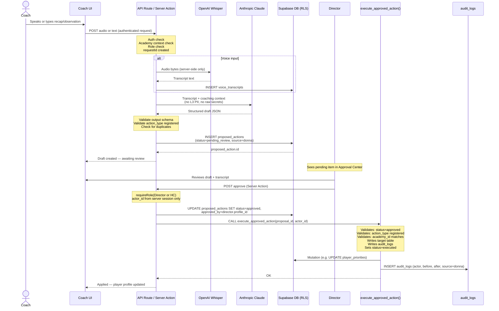
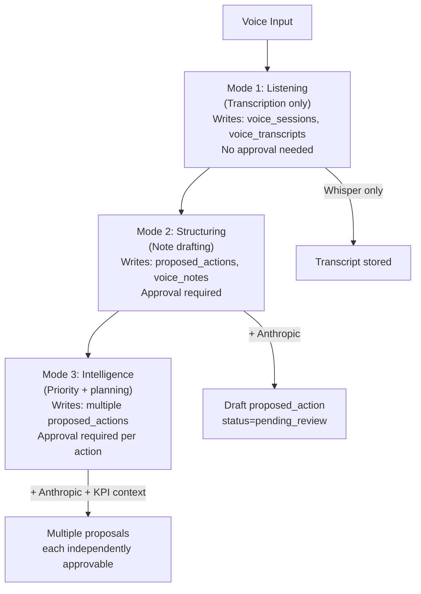
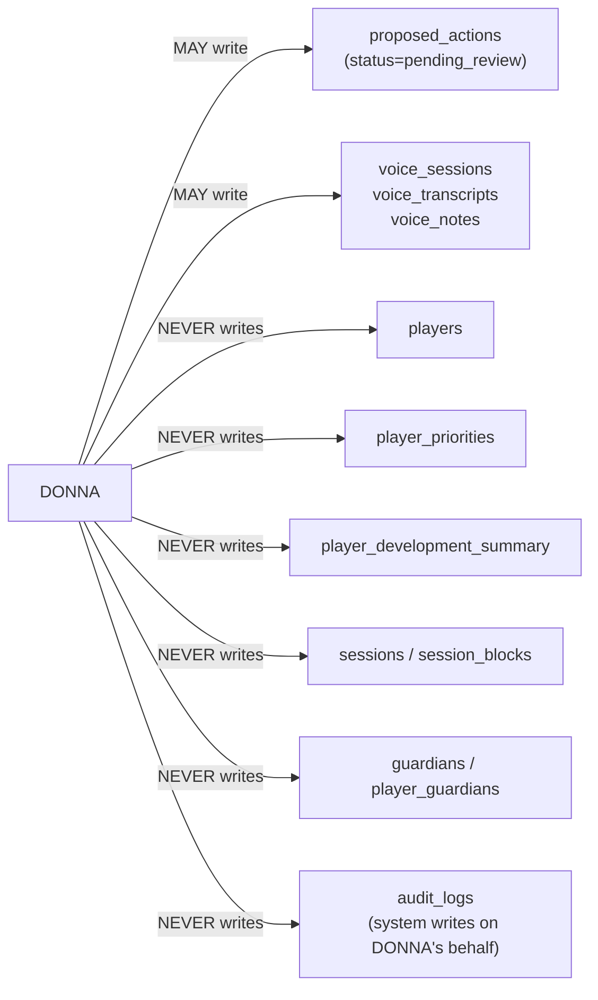

# DONNA Action Flow Map

**Last updated:** Sprint 402
**Audience:** Engineering, product
**Purpose:** Traces a DONNA action from voice/text input through to a database write — every step, every gate.
**Related code:** `src/lib/donna/`, `src/app/coach/sessions/[sessionId]/structureCoachRecapAction.ts`, `src/app/api/coach/sessions/[sessionId]/transcribe/route.ts`
**Related docs:** `docs/donna-trust-modes.md`, `docs/ai-action-safety.md`, `docs/ai-development-rules.md`
**When to update:** When DONNA's action types change, when a new voice pipeline step is added, or when the approval flow changes.

---

## Full DONNA Action Flow

---

## DONNA Trust Modes

---

## DONNA Write Surface (Hard Limits)

---

## Registered Action Types

| Action type | Effect when executed | Min approver role |
|---|---|---|
| `update_player_note` | Writes to `player_notes` | Head Coach |
| `update_player_priority` | Updates `player_priorities` | Head Coach |
| `create_session_recap` | Creates `session_notes` | Head Coach |
| `propose_session_plan` | Stages session draft | Head Coach |
| `update_development_summary` | Writes to `player_development_summary` | Director |
| `adjust_player_level` | Updates `players.current_level_id` | Director |
| `flag_player_for_review` | Sets a flag on player profile | Head Coach |

Unknown action types at execution time → rejected, logged, not executed.
