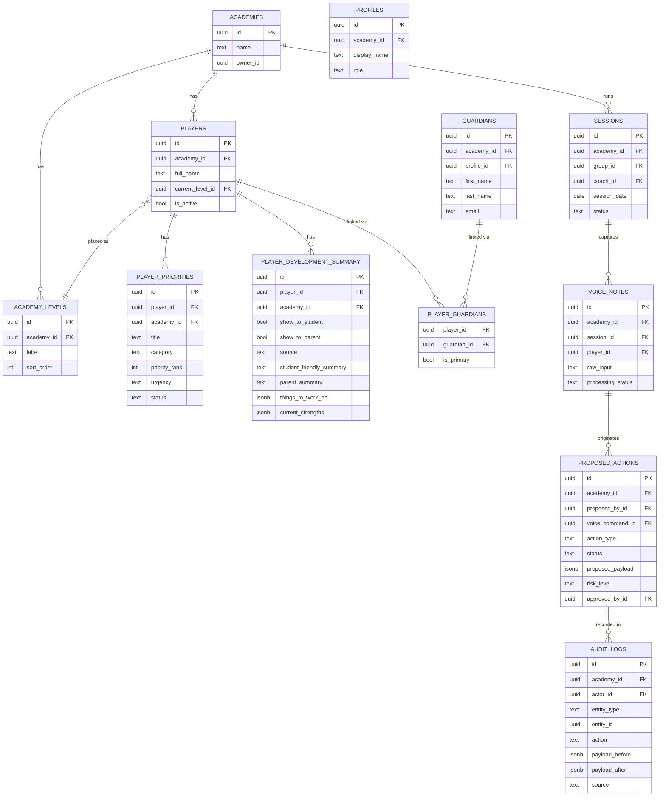
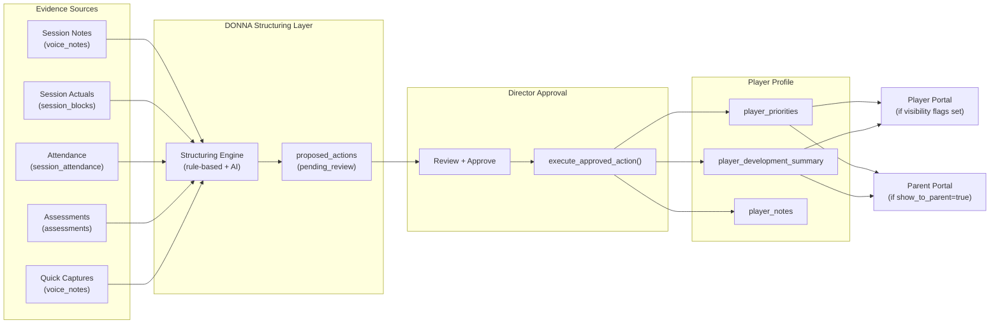

# Data Model and Evidence Map

**Last updated:** Sprint 402
**Audience:** Engineering, data
**Purpose:** Shows the core data objects, how they relate, and how evidence flows from sessions into player profiles.
**Related code:** `src/lib/supabase/database.types.ts`, `supabase/migrations/`
**Related docs:** `docs/data-classification.md`, `docs/permissions-matrix.md`
**When to update:** When a new core table is added, when evidence graph relationships change.

---

## Core Entity Relationships

---

## Evidence Flow Into Player Profile

---

## Multi-Tenancy Data Model

Every core table includes `academy_id`. This guarantees:
- No query returns cross-academy rows (enforced by RLS)
- DONNA context packs are scoped to one academy
- Evidence cannot flow between academies
- Audit logs are queryable per academy without cross-tenant exposure

The `academy_id` column is `NOT NULL` on all multi-tenant tables.
