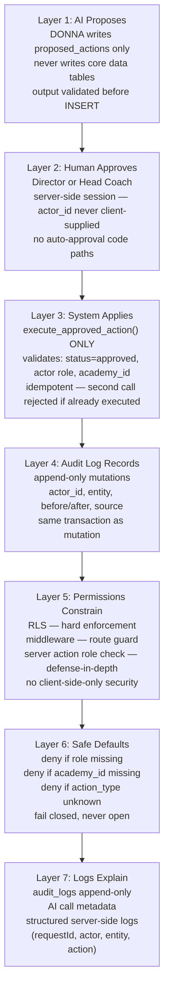
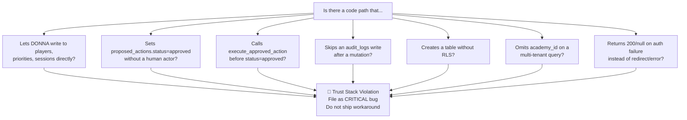
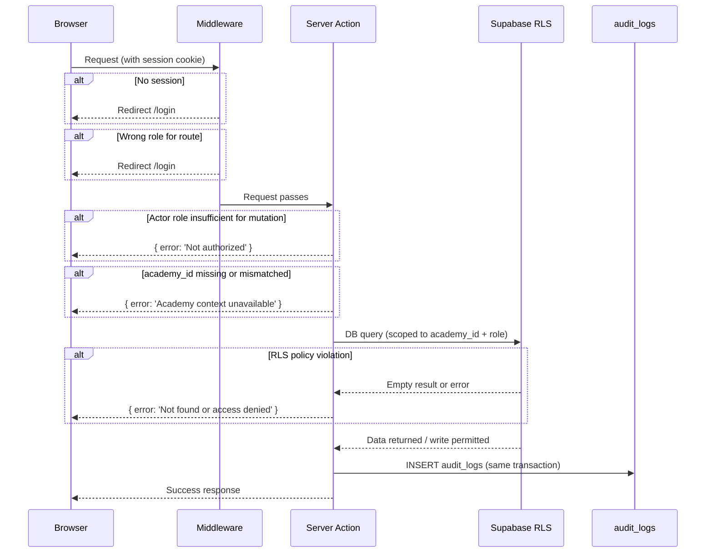
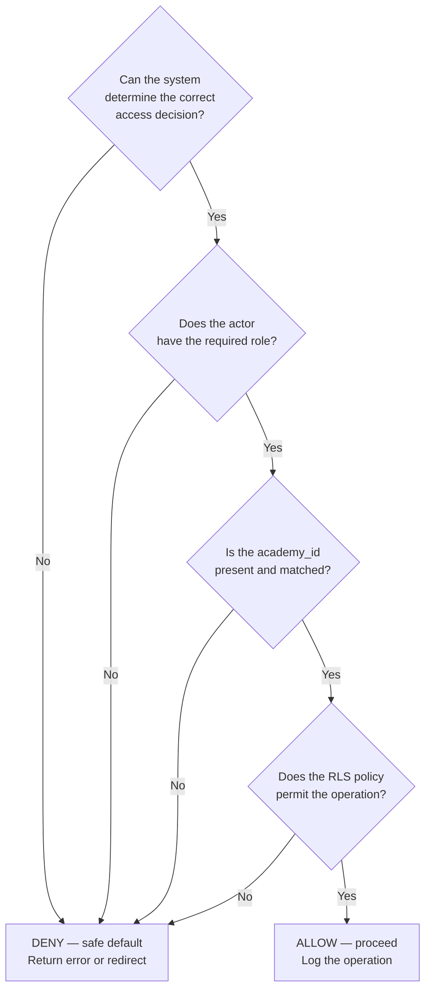

# Trust and Safety Map

**Last updated:** Sprint 402
**Audience:** Engineering, compliance, security review
**Purpose:** Shows how the Trust Stack enforces safety at every layer — from AI input to database write.
**Related code:** `src/middleware.ts`, `src/lib/idempotency/`, `src/lib/observability/`, Supabase RLS
**Related docs:** `docs/trust-stack.md`, `docs/ai-action-safety.md`, `docs/permissions-matrix.md`
**When to update:** When a new enforcement layer is added, when RLS policies change substantially, when DONNA's surface changes.

---

## The Seven-Layer Trust Stack

---

## Trust Stack Violation Detection

---

## Request Lifecycle Safety Gates

---

## Safe Default Decision Tree

