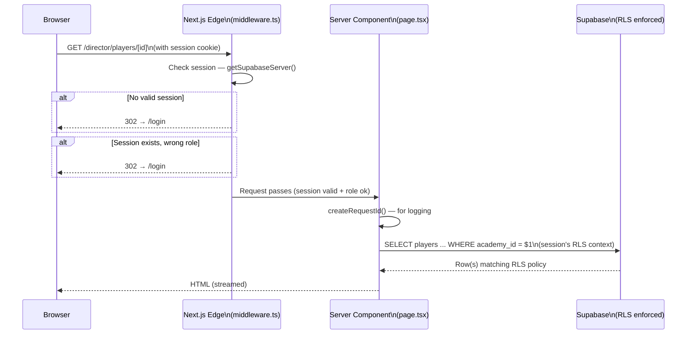
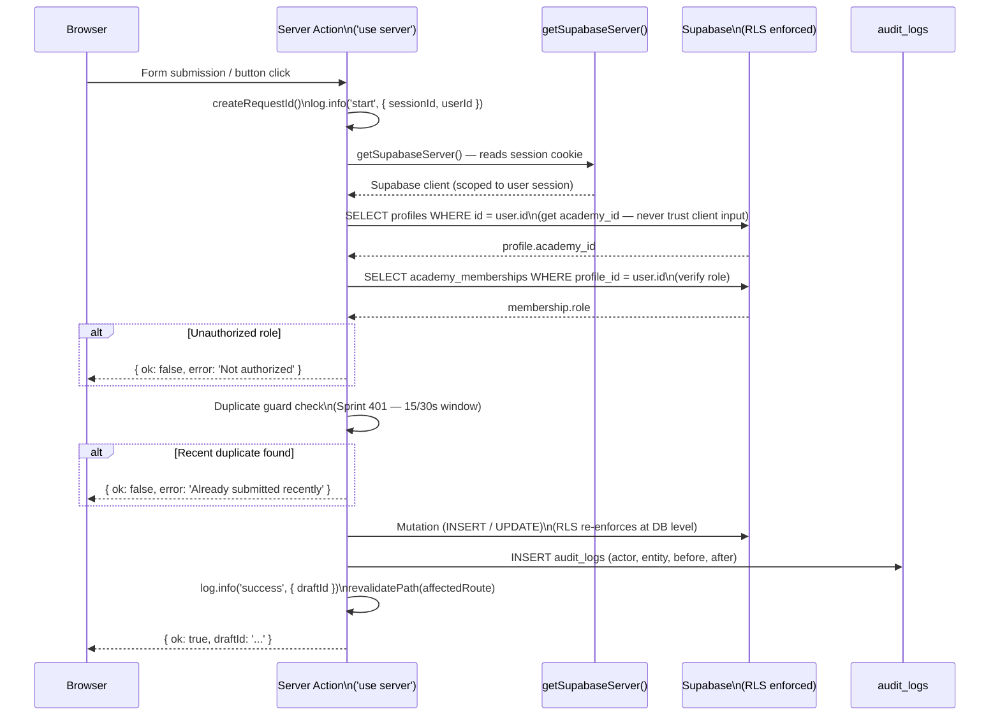
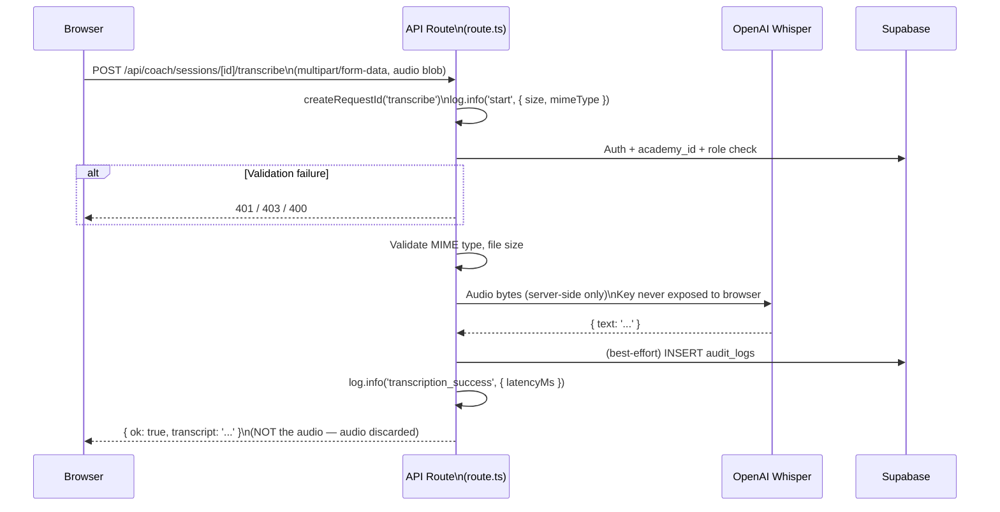
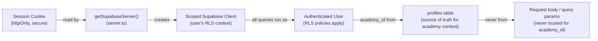

# Runtime Request Flow Map

**Last updated:** Sprint 402
**Audience:** Engineering
**Purpose:** Traces a request from browser through Next.js middleware, server components/actions, and into Supabase.
**Related code:** `src/middleware.ts`, `src/lib/supabase/server.ts`, `src/app/`
**Related docs:** `docs/trust-stack.md`, `docs/debuggability-standard.md`
**When to update:** When the auth architecture changes, when new server patterns are introduced.

---

## Standard Page Load (Server Component)

---

## Mutation Flow (Server Action)

---

## API Route Flow (Voice Transcription)

---

## Supabase Auth Session Model

