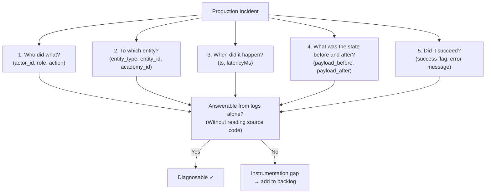
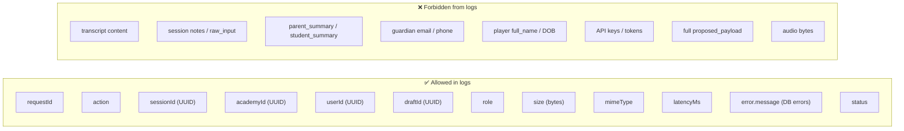
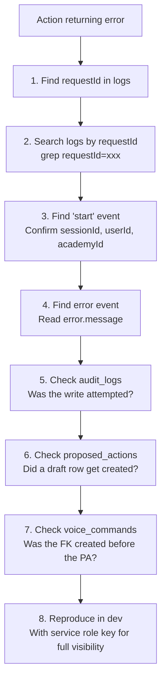

# Debugging and Observability Map

**Last updated:** Sprint 402
**Audience:** Engineering, on-call
**Purpose:** Shows how to trace, debug, and understand failures in AcademyOS using the Sprint 401 observability foundation.
**Related code:** `src/lib/observability/`, `src/lib/idempotency/`
**Related docs:** `docs/debuggability-standard.md`, `docs/OBSERVABILITY_IMPLEMENTATION_NOTES.md`, `docs/IDEMPOTENCY_IMPLEMENTATION_NOTES.md`
**When to update:** When new instrumentation paths are added, when log formats change.

---

## Five-Question Incident Diagnostic

For any production incident, the log record must answer:



---

## Request Trace Flow

```mermaid
flowchart LR
    subgraph SERVER_ACTION["Server Action / API Route"]
        RID["createRequestId(prefix)\n→ 'wrap-up-draft_20260521_abc'"]
        LOG["createActionLogger({ action, requestId })"]
        START["log.info('start', { sessionId, userId, academyId })"]
        SUCCESS["log.info('success', { draftId })"]
        ERROR["log.error('db_error', { message })"]
        WARN["log.warn('duplicate_submission', { sessionId })"]
    end

    subgraph LOG_OUTPUT["Structured Log Output (JSON line)"]
        LO1['{"ts":"2026-05-21T14:32Z","level":"info","event":"start","action":"saveWrapUpDraftAction","requestId":"...","sessionId":"...","userId":"..."}']
    end

    RID --> LOG --> START
    START --> SUCCESS
    START --> ERROR
    START --> WARN
    SERVER_ACTION --> LOG_OUTPUT
```

---

## Instrumented Paths (Sprint 401)

| Path | Events logged |
|---|---|
| `saveWrapUpDraftAction` | start, duplicate_submission, voice_command_failed, proposed_action_failed, success |
| `saveWrapUpAttendanceExceptionAction` | auth_failed, start, duplicate_submission, voice_command_failed, proposed_action_failed, success |
| `transcribe/route.ts` | missing_session_id, auth_failed, no_academy_context, access_denied, transcription_start (size+mimeType), whisper_error (status+latency), transcription_success (latency), transcription_exception |
| `structureCoachRecapAction` | auth_failed, already_structured, start, voice_command_failed, proposed_action_failed, success |

---

## Safe vs. Forbidden Log Fields



---

## Debug Checklist for Failing Actions



---

## Known Observability Gaps (as of Sprint 402)

| Gap | Priority | Sprint target |
|---|---|---|
| No log drain — logs in Vercel function logs only | Medium | Sprint 408+ |
| No AI call token count logging | High | Phase 2 |
| No client-side error boundary → server log | Medium | Phase 2 |
| No performance timing on non-AI server actions | Low | Phase 2 |
| KPI engine execution time not measured | High | Phase 2 |
| DONNA intelligence context build time not measured | High | Phase 2 |
