# Module Dependency Map

**Last updated:** Sprint 402
**Audience:** Engineering
**Purpose:** Shows which `src/lib/` modules depend on what, and highlights safe vs. risky dependency edges.
**Related code:** `src/lib/`
**Related docs:** `docs/ENGINEERING_MODULE_REGISTRY.md`
**When to update:** When a new `src/lib/` module is created or a cross-module dependency is introduced.

---

## Core Module Dependency Graph

```mermaid
graph TD
    subgraph INFRA["Infrastructure (no app dependencies)"]
        SUPABASE["supabase/\nDB client, types, server/browser helpers"]
        OBS["observability/\nrequestTrace, logger"]
        IDEM["idempotency/\nactionGuards, idempotencyKeys"]
        CACHE["cache/\ncacheKeys, ttlPolicy, revalidation"]
        RATE["rateLimit/\nrateLimitPolicy, inProcessRateLimit"]
        FLAGS["featureFlags/ (planned)"]
        KILL["killSwitches/ (planned)"]
        AUDIT["audit/ (planned)"]
        JOBS["jobs/ (planned)"]
        VER["versioning/ (planned)"]
    end

    subgraph DOMAIN["Domain Logic"]
        DONNA["donna/\ncontextPacks, drafts, actionContract"]
        VOICE["voice/\nstructureVoiceIntake, voiceDestinationRouter"]
        KPI["kpi/\nattendanceKpi, developmentHealthKpi, ..."]
        TEMPLATES["templates/\ntemplateRepository, curriculumLinks"]
        CURRICULUM["curriculum/ (via templates)"]
        PLAYER["player/\nplacement, priorities"]
        PLAYERS["players/\nplayer import, profiles"]
        SESSION_PLAN["session-planning/"]
        WRAP_UP["wrap-up/"]
        COACH["coach/"]
        PARENT["parent/"]
    end

    subgraph AI_SERVICES["External AI Services"]
        ANTHROPIC["Anthropic Claude\n(note structuring)"]
        WHISPER["OpenAI Whisper\n(transcription)"]
        TTS["OpenAI TTS\n(voice output)"]
        REALTIME["OpenAI Realtime\n(live voice)"]
    end

    subgraph TYPES["Shared Types"]
        TYPES_LIB["types/\nshared domain types"]
        UTILS["utils/\npreviewMode, general helpers"]
    end

    %% Infrastructure consumed by domain
    SUPABASE --> DONNA & VOICE & KPI & TEMPLATES & PLAYER & PLAYERS & COACH & PARENT
    OBS --> DONNA & VOICE & COACH & PARENT
    IDEM --> COACH & WRAP_UP
    CACHE --> DONNA & KPI & TEMPLATES
    RATE --> DONNA & VOICE

    %% Domain internal dependencies
    DONNA --> KPI
    DONNA --> VOICE
    DONNA --> TEMPLATES
    DONNA --> PLAYER
    VOICE --> SUPABASE
    VOICE --> ANTHROPIC & WHISPER
    KPI --> SUPABASE

    %% AI service connections
    DONNA --> ANTHROPIC
    VOICE --> WHISPER & TTS & REALTIME

    %% Types used everywhere
    TYPES_LIB --> DONNA & KPI & TEMPLATES & PLAYER
    UTILS --> COACH & PARENT & DONNA
```

---

## High-Risk Dependency Edges

| Edge | Risk | Mitigation |
|---|---|---|
| `donna/` → `kpi/` | KPI engines are synchronous and large (2,123+ lines) — block DONNA intelligence requests | Background jobs (Sprint 409) |
| `donna/` → `anthropic` | External API — cost, latency, failure | Timeouts (Sprint 401 rules), cost guards (Sprint 425) |
| `voice/` → `openai_whisper` | External API — cost per minute of audio | File size limits (already enforced), rate limiting (Sprint 403) |
| `donna/` → `supabase` | 8+ sequential DB queries per intelligence request | Select-star audit (Sprint 408), caching (Sprint 405) |

---

## Module Categories

| Category | Modules | Stability |
|---|---|---|
| Infrastructure | `supabase/`, `observability/`, `idempotency/`, `cache/`, `rateLimit/` | High — change carefully |
| AI / Voice | `donna/`, `voice/` | Medium — evolving with Trust Stack |
| Domain / KPI | `kpi/`, `templates/`, `curriculum/`, `player/`, `players/` | Medium |
| Coach ops | `coach/`, `session-planning/`, `wrap-up/` | Medium |
| Portal | `parent/`, `portal/` | Medium |
| Planned | `featureFlags/`, `killSwitches/`, `audit/`, `jobs/`, `versioning/` | Not yet implemented |

---

## Import Safety Rules

1. Infrastructure modules (`observability/`, `idempotency/`, `cache/`) must never import from domain modules.
2. Domain modules may import from infrastructure but not from each other's internals.
3. AI service calls happen only in `donna/` and `voice/` — never scattered across other modules.
4. No module imports from `src/app/` — app components import from lib, never the reverse.
5. Client components may not import server-only modules (`supabase/server`, `observability/`, `idempotency/`).
