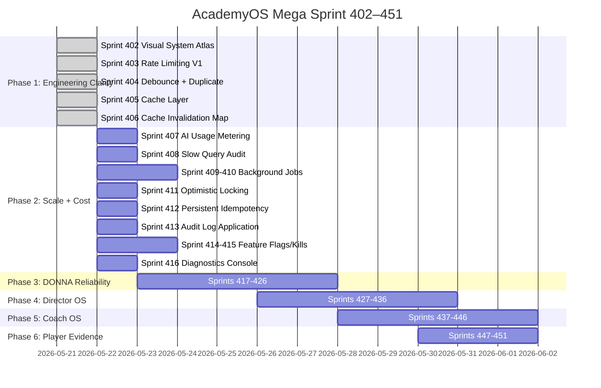
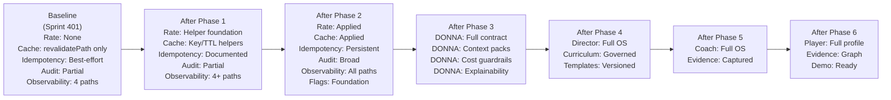

# Roadmap and Sprint Impact Map

**Last updated:** Sprint 402 (Mega Sprint 402–451 Phase 1)
**Audience:** All — engineering, PM, directors
**Purpose:** Shows the planned sprint phases, what each phase builds, and the cumulative impact on system capability.
**Related docs:** `docs/ENGINEERING_MODULE_REGISTRY.md`, `docs/SCALABILITY_COST_CONTROL_AUDIT.md`
**When to update:** After every phase commit — update the status column.

---

## Phase Overview

---

## Phase Capability Map

| Phase | Sprints | Key Capabilities Added | Status |
|---|---|---|---|
| Phase 1 | 402–406 | Visual system maps, module registry, rate limit helpers, cache utilities, debounce docs | ✅ In progress |
| Phase 2 | 407–416 | AI usage metering, select-star fixes, background job design, optimistic locking, persistent idempotency, audit log application, feature flags, kill switches, diagnostics | ⏳ Planned |
| Phase 3 | 417–426 | DONNA action contract, context packs, draft queue, approval path, screen-aware display, voice warm start, trust copy, cost guardrails, explainability | ⏳ Planned |
| Phase 4 | 427–436 | Director command center, approval center, academy setup tracker, staff management, groups, curriculum viewer, override review, template versioning, session generation | ⏳ Planned |
| Phase 5 | 437–446 | Coach dashboard, session plan mobile view, attendance exception workflow, quick capture, recap assistant, structuring engine, player observations, session actuals, parent-safe summaries | ⏳ Planned |
| Phase 6 | 447–451 | Player profile command center, development priorities, evidence graph, level-up requirements, end-to-end demo readiness | ⏳ Planned |

---

## Cumulative Safety Score by Phase

---

## Stop Conditions by Phase

A phase STOPS if it encounters:
- A required database migration (not pre-approved)
- A required RLS policy change (not pre-approved)
- A new npm dependency requirement
- A parent/player data visibility risk
- A DONNA direct mutation risk
- A destructive or irreversible operation

Each stop is reported immediately before proceeding to the next phase.
